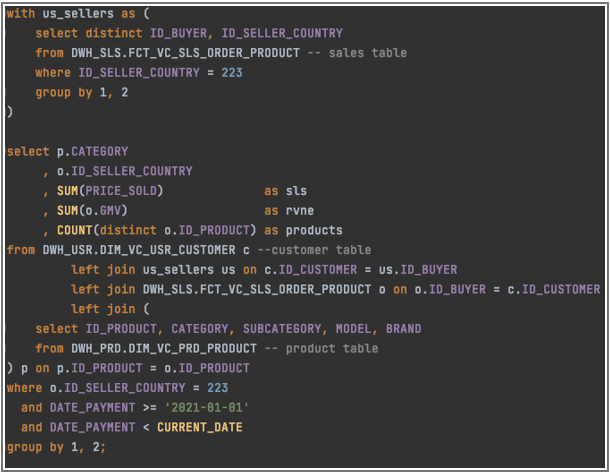
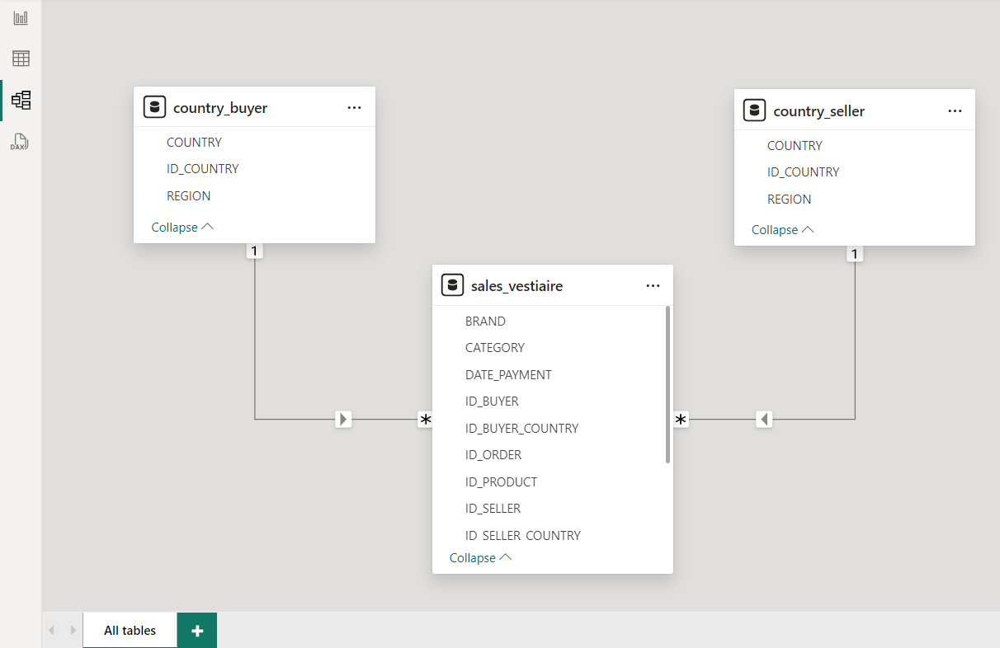

# Description du projet

Ce test technique m'a été attribué par une grande entreprise spécialisée dans la vente de vêtements de luxe, dans le cadre de ma candidature à un stage. Les requêtes SQL demandées constituaient une excellente opportunité de réviser mes compétences en SQL. J'ai également envisagé de développer un tableau de bord après avoir terminé les requêtes.

J'ai importé les deux fichiers dans SQL Server afin de pouvoir exécuter les requêtes demandées. J'ai utilisé Python (Jupyter Notebook) pour mener à bien ce projet. Pour ce faire, j'ai créé un fichier JSON (conf.json) contenant les différentes informations d'identification nécessaires pour établir la connexion avec ma base de données dans SQL server.
Vous trouverez donc les différentes requêtes SQL dans le dossier 'queries' et leurs résultats respectifs dans le fichier Main.py.ipynb.

NB : Pour les questions nécessitant une rédaction, j'ai répondu directement dans ce document, ainsi que pour les dernières questions demandant le code correspondant de Snowflake.

Dans la dernière section, j'ai choisi de faire une "Data Visualisation", j'ai créé un tableau de bord intuitif et dynamique pour mieux comprendre les données (ci-dessous le dashboard associé)
J'ai représenté le jeu de données en utilisant le schéma relationnel approprié (ci-dessous la capture d'écran) 

# énoncé du test

BI Engineering Test

Please note you will need the following files to complete this test:
sales.csv
country.csv

All answers require you to submit the solution as a query and not a result. You may use any SQL syntax you are familiar with to complete the test. Additional Note: Please attach your queries in text format (and not as images) for testing purposes.

Please submit your answers back to your interviewer as discussed during your interview or outlined in the email. If you have no frame of reference, you should return the test within 2 business days. You may attach your answers within this document or in a separate file.

The last note we would like to add is, we know your time is valuable and we really appreciate you taking the time to do this test, it will greatly assist with assessing your skills and providing valuable feedback.

When writing queries, keep the following in mind -> Write simple not complex. Readability is important. Use logical names for everything.

### 1.	What are the top 10 brands by revenue in the sales.csv table?
(Regardez la requête dans Main.py)

### 2.	Write a query to calculate the contribution (in percentage) of each country to the total by both sales and nb of items sold. I.e. If France sold 10/100 items, then you should have 10% as the contribution for France of items sold.
(Regardez la requête dans Main.py)

### 3.	Which two countries had the best relationship in terms of revenue? Include the revenue in both directions, e.g. If France sells to Germany and Germany sells to France, then you must aggregate both into a single row in your table.
(Regardez la requête dans Main.py)

### 4.	When and why should you create a table or a view?
Tables should be created when there is a need to store structured data persistently. They define the schema, including columns, data types, and relationships, ensuring data integrity and supporting efficient querying through normalization. Views, on the other hand, are virtual tables that simplify complex queries, encapsulate logic, and present a subset or transformed view of data without physical storage. They enhance security by restricting data access and improve performance by pre-computing results. The choice between tables and views hinges on data storage requirements, query complexity, performance, and security considerations.

### 5.	What is the percentage of buyers who bought in week 2 that also purchased at least 1 item in week 1? (you may assume week 1 as the 1/1/2021 to 7/1/2021 and the second week as 8/1/2021 to 15/1/2021)
(Regardez la requête dans Main.py)

### 6.	What was the total revenue of repeat buyers in the first week compared to the second week? (answer in % increase or decrease). Note that you must first find the buyers who bought in both week 1 and week 2, and then use this list to calculate the sales in both weeks.
(Regardez la requête dans Main.py)

### 7.	The business has approached you wanting to implement a new tool that is able to combine data from several sources easily and provide basic visualisation capabilities. What would you consider in your decision making process and why?

When evaluating the implementation of a new tool that combines data from multiple sources and offers basic visualization capabilities, several critical factors come into play. First and foremost, compatibility with existing data systems is crucial to ensure smooth integration and minimal disruption to current operations. Scalability is another key consideration, ensuring the tool can handle increasing data volumes and support more sophisticated analyses as business needs evolve. User-friendliness is essential to facilitate adoption across different teams, enabling non-technical users to manipulate and visualize data easily. Data quality and security are paramount, requiring robust features for cleansing, validating, and securing sensitive information in compliance with regulations. Cost-effectiveness and the ability to customize functionalities further determine the tool's suitability, ensuring it meets both operational requirements and budgetary constraints effectively.

### 8.	Write a statement to do the following:
### a.	Change the region of Australia and New Zealand to ‘OCEA’
### b.	Insert a new row with the following values ID_COUNTRY = 246, REGION = ‘SPACE’, COUNTRY = ‘Mars’
### c.	Delete the row with ID_COUNTRY = 0
Tip: It can be done with a single statement but you must first create a table or use a subquery containing your updates: https://docs.snowflake.com/en/sql-reference/sql/merge.html
https://www.sqlshack.com/understanding-the-sql-merge-statement/

        merge into country as tgt
        using (
            select 0 as id_country, 'oce' as region, country
            union all
            select 246 as id_country, 'space' as region, 'mars' as country
        ) as src
        on tgt.id_country = src.id_country
        when matched then
        update set tgt.region = src.region, tgt.country = src.country
        when not matched then
            insert (id_country, region, country)
            values (src.id_country, src.region, src.country);

        delete from country where id_country = 0;

### 9.	Write a query that is able to take all id_buyers split into odd and even groups in a JSON format. Your output should consist of two arrays inside of a json ->
{
Id_buyers: [2,4,6...]
Is_even: true
},
{
Id_buyers: [1,3,5...]
Is_even: false
}
Hint: https://docs.snowflake.com/en/sql-reference/functions/listagg.html
https://docs.snowflake.com/en/sql-reference/functions/object_construct.html

        SELECT OBJECT_CONSTRUCT(
                'Id_buyers', ARRAY_AGG(id_buyers) FILTER (WHERE MOD(id_buyers, 2) = 0),
                'Is_even', TRUE
            ) AS even_group,
            OBJECT_CONSTRUCT(
                'Id_buyers', ARRAY_AGG(id_buyers) FILTER (WHERE MOD(id_buyers, 2) != 0),
                'Is_even', FALSE
            ) AS odd_group
        FROM buyers;

### 10.	Make a list of everything you think can be improved in the following query. 
Note: There is a lot to be improved here, be very critical.

#### Formatting and Clarity:
Properly formating the SQL query with indentation and line breaks for better readability.
Ensuring keywords (SELECT, FROM, LEFT JOIN, WHERE, GROUP BY) are capitalized consistently.
Removing unnecessary characters like asterisks (*) that might be typos.

#### Table and Column Aliases:
Using meaningful aliases (c, o, p, etc.) consistently throughout the query to improve readability and reduce redundancy.

#### Comments:
Removing unnecessary comments that are not adding any useful information or correct the ones that are incorrect or confusing.

#### Joins and Conditions:
Checking for correctness in join conditions (c.ID_CUSTOMER = us.ID_BUYER, O.ID_BUYER = c.ID_CUSTOMER).
Correcting the LEFT JOIN condition (LEFT JOIN us_sellers us ON c.ID_CUSTOMER = us.ID_BUYER).

#### Subquery:
Ensuring that the subquery for DWH_PRD.DIM_VC_PRD_PRODUCT is correctly formatted and provides the necessary fields (ID_PRODUCT, CATEGORY, SUBCATEGORY, MODEL, BRAND).

#### Aggregations and Grouping:
Verifying that aggregations (SUM(), COUNT()) and grouping (GROUP BY) are used correctly with appropriate columns.

#### Filter Conditions:
Verifying that filter conditions (ID_SELLER_COUNTRY = 223, DATE_PAYMENT >= '2021-01-01', etc.) are correctly applied and meaningful.

#### Column Aliasing:
Ensuring that all columns selected have aliases assigned (SUM(PRICE_SOLD) AS SLS, SUM(O.GHV) AS rune, COUNT(DISTINCT o.ID_PRODUCT) AS products).

# Data visualisation

Ceci est le shémas relationnel que j'ai fait, j'ai choisi de dupliquer la table country afin de pouvoir faire la double jointure avec la table sales_vestiare avec la colonne ID_country

Et finalement le dashboard que j'ai créé qui permet juste de voir les données de plus prés, je l'ai donc réparti en "vue générale" et "quelques KPI et des visuels plus détaillés"

[DASHBOARD](data_viz/Dashboard_vestiaire_24-06.pdf)